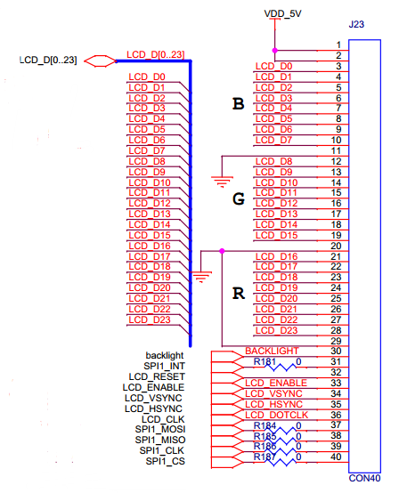
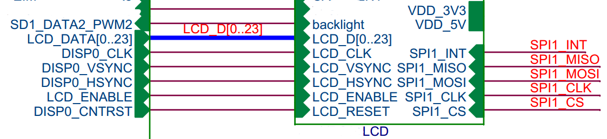
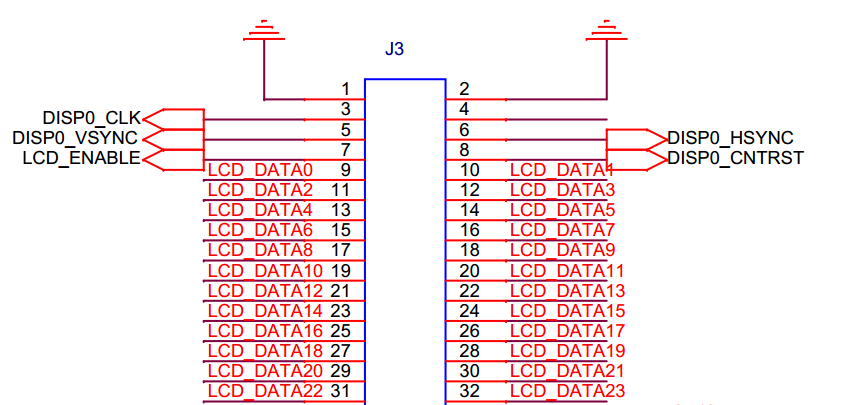
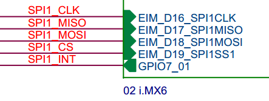
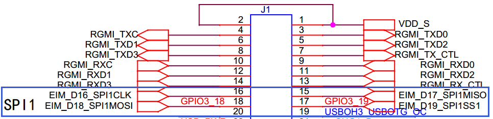
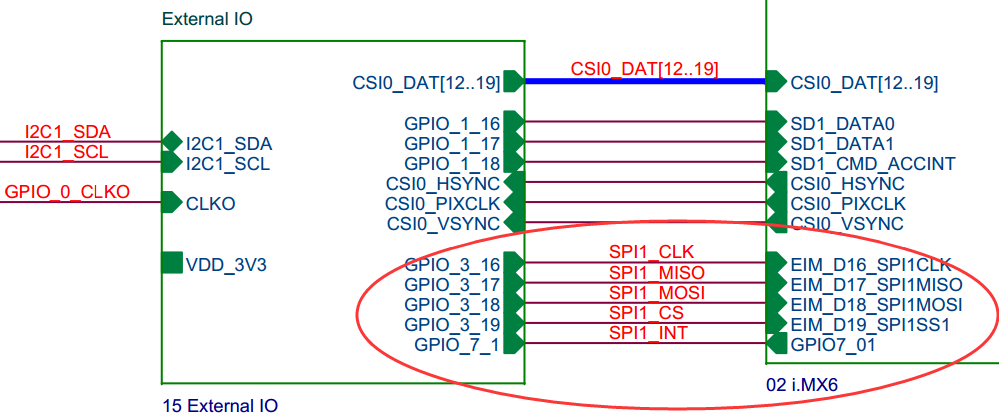
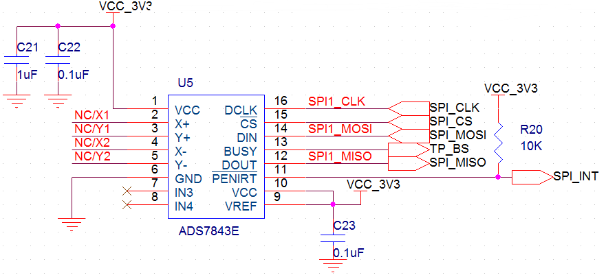

LCD 显示器
**************

并口LCD
===============
* Blurr 开发板上支持一组并口LCD接口，接口定义如下图所示： 

* 其中 SPI 接口为电阻触摸芯片控制接口，触摸芯片建议选用ADS7843E，这个芯片的驱动我们已经开发，如选用其他型号触摸芯片，不提供免费驱动支持。
* 屏对应核心板上引脚接口定义如下：

* 触摸芯片SPI接口对应核心板接口如下：

* GPIO7_01引脚对应 J3-59。
* 需要注意，开发板上SPI接口同时也以GPIO口的形式在板上有预留接口，使用时请注意，如下图所示：

* 触摸芯片ADS7843E的参考电路如下：

LVDS
==========

HDMI
===========
